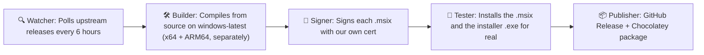

# FluentFlyout Unofficial Builds

> **Unofficial**, automated, community-maintained builds of [FluentFlyout](https://github.com/unchihugo/FluentFlyout) rebuilt directly from upstream source on every release and republished here and via Chocolatey.

[](../../actions)
[](../../releases/latest)
[](LICENSE)
[](https://community.chocolatey.org/packages/fluentflyout-unofficial)

---

## What this is

FluentFlyout is a free, open-source Fluent 2–styled media flyout app for Windows 11. The only official way to get a ready-to-install build is the Microsoft Store, where the full feature set sits behind a "small" paid unlock. The project's own GitHub page provides source code only, no compiled installer.

This repo closes that gap: it automatically rebuilds FluentFlyout straight from that public source, with every feature already unlocked and no payment required, and keeps it install-ready here and on Chocolatey.



Runs entirely on GitHub Actions. No manual steps once a new upstream tag is detected.

---

## Installation

### Option 1️⃣ One-Click Installer **(Easiest, no auto-update)**

1. Go to the [Releases page](../../releases/latest) and download `FluentFlyout_Installer.exe`.
2. Run it.
3. Windows will likely show a **"Windows protected your PC"** SmartScreen warning first, click **More info → Run anyway**. This shows up because the installer itself isn't signed yet, not because anything is wrong.
4. Approve the admin (UAC) prompt that follows.

That's it! the installer detects your CPU architecture, downloads the right files, trusts the certificate, and installs the app automatically. No manual certificate steps.

> Note: this installer doesn't auto-update. Re-download and re-run it whenever a new version comes out, or use Option 2 below if you'd rather updates happen on their own.

### Option 2️⃣ Chocolatey (auto-updating)

```powershell
choco install fluentflyout-unofficial
```

Future updates: `choco upgrade fluentflyout-unofficial` (or let your regular `choco upgrade all` pick it up).

> Note: you must have the chocolatey package manager installed first.

### Option 3️⃣ GitHub Release (Fully manual)

1. Go to the [Releases page](../../releases/latest).
2. Figure out which CPU your PC has:
   - **Most PCs and laptops** → **x64**
   - **Surface Pro X, Snapdragon-based "Copilot+ PC" laptops** → **ARM64**
   - Not sure? Open **Settings → System → About** and check "System type."
3. Download **both**:
   - `signing.cer`
   - `FluentFlyout_<version>_x64.msix` **or** `FluentFlyout_<version>_ARM64.msix` (whichever matches your CPU)
4. Right-click the `.cer` file → **Install Certificate** → **Local Machine** → **Place all certificates in the following store** → **Trusted People** → **Finish**.
5. Double-click the `.msix` file → the Windows App Installer will open → **Install**.

> **Note:** these builds are lightweight (framework-dependent), meaning Windows may prompt you to install the **.NET Desktop Runtime** the first time you launch the app if it isn't already on your system. This is a normal, small, one-time Microsoft download, not something this project manages.

### Verifying what you're installing

Every release includes a `SHA256SUMS.txt` file and a `build-provenance.json` noting:
- The exact upstream commit/tag this build was compiled from
- The GitHub Actions run that produced it (fully inspectable, logs are public)

We encourage you to check both rather than blindly trusting any binary, including ours.

---

## How the automation works

| Stage | Trigger | What happens |
|---|---|---|
| **Watch** | Cron, every 6 hours | Polls the upstream GitHub API for the latest release tag; compares against this repo's own most recent release. |
| **Build** | New tag detected | Checks out the upstream repo at that exact tag, restores NuGet packages, builds **separate, lightweight** MSIX packages for x64 and ARM64 (framework-dependent, English-only resources, no bundled .NET runtime or unused translation files). |
| **Sign** | After successful build | Signs **each architecture's `.msix` file individually** with this project's own self-signed certificate (see below on trust) kept separate rather than combined, so an issue with one architecture never affects the other. |
| **Test** | After signing | Actually installs the signed `.msix` and runs the installer `.exe` silently on a real Windows machine, before anything is published. |
| **Publish** | After testing | Creates a GitHub Release here with the `.msix` files + cert + checksums (+ the installer `.exe`, if it passed testing), then packs and pushes an updated Chocolatey package. |

Full workflow source: [`.github/workflows/FluentFlyout Unofficial Publication Script.yml`](.github/workflows/FluentFlyout%20Unofficial%20Publication%20Script.yml)

### About the signing certificate

FluentFlyout itself uses a self-signed cert (real EV certs are expensive for indie/community projects). This repo does the same, but with **our own separate certificate**, meaning trusting this repo's builds is a distinct decision from trusting upstream's official builds. The cert's public fingerprint is published in every release's `SHA256SUMS.txt` so you can verify it hasn't changed unexpectedly between versions.

---

## Disclaimer & Attribution

This project is **not affiliated with, endorsed by, or maintained by** the original FluentFlyout author ([@unchihugo](https://github.com/unchihugo)). All credit for FluentFlyout's design, functionality, and code belongs to the upstream project and its contributors.

This repository exists solely to provide **free, automatically-built binaries**, nothing here is hidden, obfuscated, or different from what the public source code does.

FluentFlyout is licensed under the **GNU General Public License v3.0**. This project, as a derivative distribution of that work, is licensed under the same terms, see [`LICENSE`](LICENSE). In accordance with GPLv3:

- Every build here is clearly marked as a modified/rebuilt redistribution, not the original.
- Full corresponding source is always available; either at the upstream repo directly, or in this repo's build logs, which pin the exact commit/tag used.
- No additional restrictions are placed on top of GPLv3. You are free to use, modify, and redistribute these builds under the same license.

**Please consider supporting the original developer**, via the [Microsoft Store version](https://apps.microsoft.com/detail/9n45nsm4tnbp) (small optional paid unlock) or [GitHub Sponsors](https://github.com/sponsors/unchihugo), if the app is useful to you and you're able to.

---

## FAQ

**Is this safe?**
Nothing here is installed silently or without your say-so, you still have to manually choose to trust it, the same way you would with any app that isn't from the Microsoft Store. Here's what that trust actually rests on:
- Every build is made by a robot (GitHub Actions), not a person typing commands by hand so, there's no manual step where someone could sneak in extra code before it reaches you.
- That robot builds directly from the exact same public source code as the original FluentFlyout project, nothing is removed, or changed.
- Every release shows exactly which version of the original source it was built from, so anyone can check that the build matches what the original developer actually published.
- That said, you are trusting *this project's maintainer* to keep it that way. If you'd rather not trust anyone but the original developer, the Microsoft Store version remains the safest option, since Microsoft itself reviews and signs it.

**Why not just use the Microsoft Store version?**
You absolutely can, and it directly supports the original developer, which is worth doing if you're able to. This project exists for people who can't pay for the Store unlock, GPLv3 guarantees the same functionality is available to build for free from source, but doing that yourself takes technical knowledge most people don't have or want to deal with. This repo automates that free path instead: one install command, and updates happen on their own.

**Will this break if upstream changes their build process?**
Possibly... if the original project restructures its code significantly, the automated build here may need updates too. If a release ever fails to appear, it usually means the automation notified the maintainer(s). Issues/PRs welcome if you notice a gap.

**Does this unlock the paid Store features? Does that hurt the original developer?**
Yes, it unlocks them... that's the actual point of this project. FluentFlyout's Store paywall is a purchase check against Microsoft's servers, not something baked into the app's actual code, and GPLv3 means the original author can't legally lock any feature behind payment in the source itself. The Store payment is effectively an optional, forced-feeling way of asking for a donation. This project doesn't think that's an unreasonable thing to want to support if you can, but it also doesn't think everyone should have to pay to use free, open-source software. Purchasing power varies enormously around the world, and a flat price that's minor in one country can be genuinely significant in another. Building from source yourself would get you the exact same result, this project just saves you that step. If FluentFlyout is useful to you and you're in a position to support the original author's work, please consider supporting him.

**Why does the app still show "PREMIUM" badges and Store-related text if everything's unlocked?**
Because this project deliberately doesn't touch the app's UI or code at all beyond the minimal identity/credit changes described above, it compiles unchihugo's source exactly as published. Those "PREMIUM" labels, and the onboarding screen's Store-related wording, are part of that same shared codebase the Store version uses, not something this project added or controls. They're leftover cosmetic labels, not a functional gate, every feature behind them works normally once toggled on. We've deliberately left them as-is rather than patching them out, because doing so would mean maintaining a second, ongoing fork of the UI that has to be kept in sync with upstream forever, instead of the current process, which stays simple by changing as little as possible. If this ever becomes genuinely confusing in practice, it's open to reconsideration, see [Contributing](#contributing).

---

## Contributing

Issues and PRs welcome, especially for:
- Build pipeline fixes if upstream's project structure changes
- Testing on real ARM64 hardware (the build is automated, but real-device testing helps catch issues)
- Chocolatey package review/approval help
- Testing installs on real, non-Sandbox machines, UAC and SmartScreen behavior can differ from what CI and Sandbox testing catches
- Help pursuing a proper code-signing certificate (e.g. via SignPath Foundation's free program for open-source projects), which would remove the SmartScreen warning and reduce antivirus false-positive risk at the root

---

## Acknowledgments

This repository's automation pipeline (workflow design, debugging, and documentation) was built with the assistance of [Claude](https://claude.com), Anthropic's AI assistant. All actual code execution, testing, and decisions were reviewed and approved by the repo maintainer — Claude doesn't have direct access to this repository or its infrastructure.

---

## License

This project is licensed under the **GNU General Public License v3.0** — see [`LICENSE`](LICENSE) for the full text. Same license as upstream FluentFlyout, as required by GPLv3 §5(b)–(c).

FluentFlyout is © its original author and contributors. This repository redistributes modified/rebuilt versions under the same license terms.
