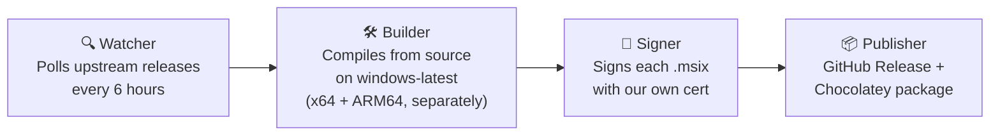

# FluentFlyout Unofficial Builds

> **Unofficial**, automated, community-maintained builds of [FluentFlyout](https://github.com/unchihugo/FluentFlyout) — rebuilt directly from upstream source on every release and republished here and via Chocolatey.

[](../../actions)
[](../../releases/latest)
[](LICENSE)
[](https://community.chocolatey.org/packages/fluentflyout-unofficial)

---

## ⚠️ Disclaimer & Attribution

This project is **not affiliated with, endorsed by, or maintained by** the original FluentFlyout author ([@unchihugo](https://github.com/unchihugo)). All credit for FluentFlyout's design, functionality, and code belongs to the upstream project and its contributors.

This repository exists solely to provide **free, automatically-built binaries** for people who want to install FluentFlyout without going through the Microsoft Store, at times when the upstream project doesn't attach compiled installers to a given release.

FluentFlyout is licensed under the **GNU General Public License v3.0**. This project, as a derivative distribution of that work, is licensed under the same terms — see [`LICENSE`](LICENSE). In accordance with GPLv3:

- Every build here is clearly marked as a modified/rebuilt redistribution, not the original.
- Full corresponding source is always available — either at the upstream repo directly, or in this repo's build logs, which pin the exact commit/tag used.
- No additional restrictions are placed on top of GPLv3. You are free to use, modify, and redistribute these builds under the same license.

**Please consider supporting the original developer** — via the [Microsoft Store version](https://apps.microsoft.com/detail/9n45nsm4tnbp) (small optional paid unlock) or [GitHub Sponsors](https://github.com/sponsors/unchihugo), if the app is useful to you.

---

## What this is

FluentFlyout is a free, open-source Fluent 2–styled media flyout app for Windows 11. The upstream project publishes to the Microsoft Store and (inconsistently) to GitHub Releases — some tags ship a signed `.msixbundle`, others only include GitHub's auto-generated source archives.

This repo closes that gap with a simple pipeline:



Runs entirely on GitHub Actions. No manual steps once a new upstream tag is detected.

---

## Installation

### Option 1 — Chocolatey (recommended, auto-updating)

```powershell
choco install fluentflyout-unofficial
```

Future updates: `choco upgrade fluentflyout-unofficial` (or let your regular `choco upgrade all` pick it up).

### Option 2 — GitHub Release (manual)

1. Go to the [Releases page](../../releases/latest).
2. Figure out which CPU your PC has:
   - **Most PCs and laptops** → **x64**
   - **Surface Pro X, Snapdragon-based "Copilot+ PC" laptops** → **ARM64**
   - Not sure? Open **Settings → System → About** and check "System type."
3. Download **both**:
   - `signing.cer`
   - `FluentFlyout_<version>_x64.msix` **or** `FluentFlyout_<version>_ARM64.msix` (whichever matches your CPU)
4. Right-click the `.cer` file → **Install Certificate** → **Local Machine** → **Place all certificates in the following store** → **Trusted Root Certification Authorities** → **Finish**.
5. Double-click the `.msix` file → the Windows App Installer will open → **Install**.

> **Note:** these builds are lightweight (framework-dependent), meaning Windows may prompt you to install the **.NET Desktop Runtime** the first time you launch the app if it isn't already on your system. This is a normal, small, one-time Microsoft download — not something this project manages.

### Verifying what you're installing

Every release includes a `SHA256SUMS.txt` file and a `build-provenance.json` noting:
- The exact upstream commit/tag this build was compiled from
- The GitHub Actions run that produced it (fully inspectable — logs are public)

We encourage you to check both rather than blindly trusting any binary, including ours.

---

## How the automation works

| Stage | Trigger | What happens |
|---|---|---|
| **Watch** | Cron, every 6 hours | Polls the upstream GitHub API for the latest release tag; compares against the last version this repo has built. |
| **Build** | New tag detected | Checks out the upstream repo at that exact tag, restores NuGet packages, builds **separate, lightweight** MSIX packages for x64 and ARM64 (framework-dependent, English-only resources — no bundled .NET runtime or unused translation files). |
| **Sign** | After successful build | Signs **each architecture's `.msix` file individually** with this project's own self-signed certificate (see below on trust) — kept separate rather than combined, so an issue with one architecture never affects the other. |
| **Publish** | After signing | Creates a GitHub Release here with both `.msix` files + cert + checksums, then packs and pushes an updated Chocolatey package. |

Full workflow source: [`.github/workflows/build.yml`](.github/workflows/build.yml)

### About the signing certificate

FluentFlyout itself uses a self-signed cert (real EV certs are expensive for indie/community projects). This repo does the same, but with **our own separate certificate** — meaning trusting this repo's builds is a distinct decision from trusting upstream's official builds. The cert's public fingerprint is published in every release's `SHA256SUMS.txt` so you can verify it hasn't changed unexpectedly between versions.

---

## FAQ

**Is this safe?**
Nothing here is installed silently or without your say-so — you still have to manually choose to trust it, the same way you would with any app that isn't from the Microsoft Store. Here's what that trust actually rests on:
- Every build is made by a robot (GitHub Actions), not a person typing commands by hand — so there's no manual step where someone could sneak in extra code before it reaches you.
- That robot builds directly from the exact same public source code as the original FluentFlyout project — nothing is added, removed, or changed.
- Every release shows exactly which version of the original source it was built from, so anyone can check that the build matches what the original developer actually published.
- That said, you are trusting *this project's maintainer* to keep it that way. If you'd rather not trust anyone but the original developer, the Microsoft Store version remains the safest option, since Microsoft itself reviews and signs it.

**Why not just use the Microsoft Store version?**
You absolutely can, and for most people it's still the easiest choice. This project exists specifically for people who:
- Don't want to pay for the optional Store unlock, and
- Don't know how to code, so manually downloading files, trusting certificates, and reinstalling every update themselves (the normal "free" GitHub path) feels intimidating or fiddly.

This repo automates that free path for you — one install command, and updates happen on their own, without needing to touch a certificate or a `.msixbundle` file yourself.

**Will this break if upstream changes their build process?**
Possibly — if the original project restructures its code significantly, the automated build here may need updates too. If a release ever fails to appear, it usually means this is being fixed. Issues/PRs welcome if you notice a gap.

**Does this affect the original developer's revenue? Am I unlocking the paid Store features this way?**
No, and no — this is an important distinction. The extra features unlocked by the small Store payment aren't "hidden" in the code waiting to be switched on; the app checks with Microsoft's Store servers to confirm you actually paid, and a build installed outside the Store has no way to pass that check. This project doesn't touch, remove, or bypass that check in any way — doing so would go against the spirit of supporting the developer, even though the app's license would technically permit modifying the code.

In short: this repo gives you exactly the same free feature set the original developer already offers for free on their own GitHub page — just packaged in a way that's easier to install and keep updated. Nothing paywalled is unlocked, and nobody who would've paid is being given a reason not to.

---

## Contributing

Issues and PRs welcome — especially for:
- Build pipeline fixes if upstream's project structure changes
- Testing on real ARM64 hardware (the build is automated, but real-device testing helps catch issues emulation might miss)
- Chocolatey package review/approval help

---

## Acknowledgments

This repository's automation pipeline (workflow design, debugging, and documentation) was built with the assistance of [Claude](https://claude.com), Anthropic's AI assistant. All actual code execution, testing, and decisions were reviewed and approved by the repo maintainer — Claude doesn't have direct access to this repository or its infrastructure.

---

## License

This project is licensed under the **GNU General Public License v3.0** — see [`LICENSE`](LICENSE) for the full text. Same license as upstream FluentFlyout, as required by GPLv3 §5(b)–(c).

FluentFlyout is © its original author and contributors. This repository redistributes modified/rebuilt versions under the same license terms.
