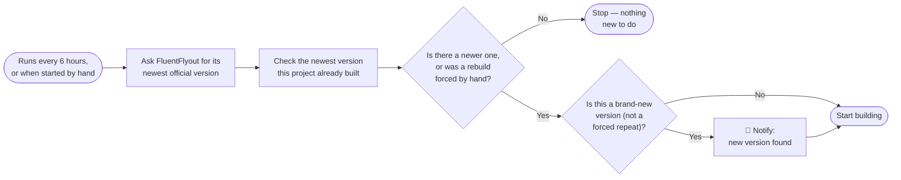
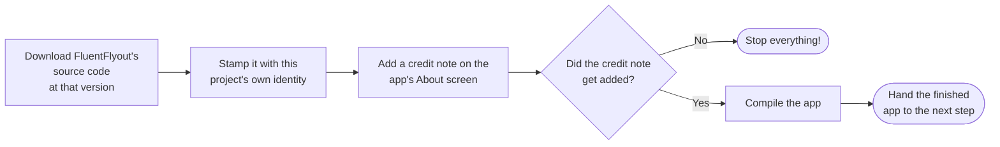
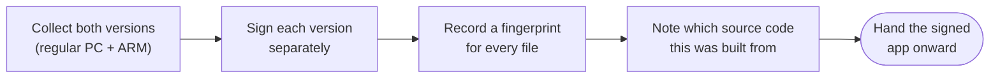
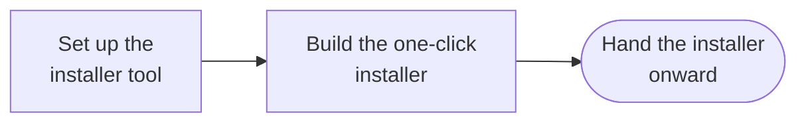
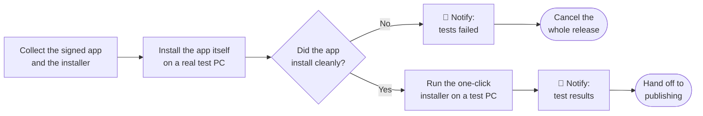
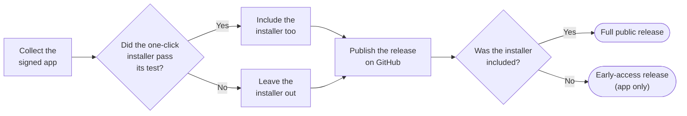
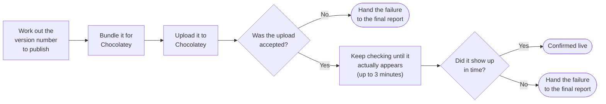
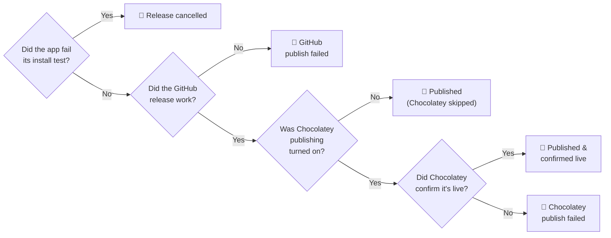

# FluentFlyout Unofficial — Pipeline Flowchart

One diagram per job in `.github/workflows/FluentFlyout Unofficial Publication Script.yml`, in the order they run. Steps flow left to right within each job; the jobs themselves follow top to bottom down this page.

Wherever the maintainer gets a phone notification, it's drawn as a **📱 Notify** step (these all go out through ntfy).

## 1. Check for a new version

Decides whether there's anything new worth building at all.

## 2. Build the app

Runs twice at the same time — once for regular PCs, once for ARM devices.

## 3. Sign the app

Signing is what lets Windows trust the app came from this project unmodified.

## 4. Build the easy installer

The one-click `.exe` most people will actually download.

## 5. Test that it actually installs

The most important job — this decides whether anything gets released, and in what form.

## 6. Publish to GitHub

## 7. Publish to Chocolatey

Chocolatey is the auto-updating install option. This job only runs if the one-click installer passed *and* Chocolatey publishing was turned on.

## 8. Send the final report

Always runs last, whatever happened, and sends the maintainer one summary notification.

